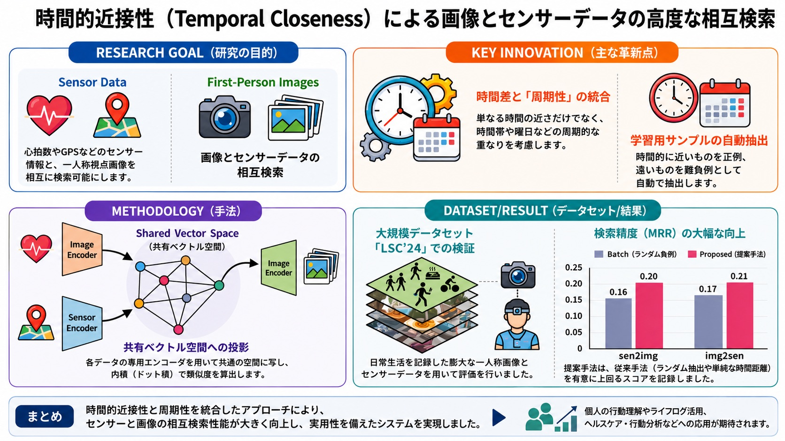
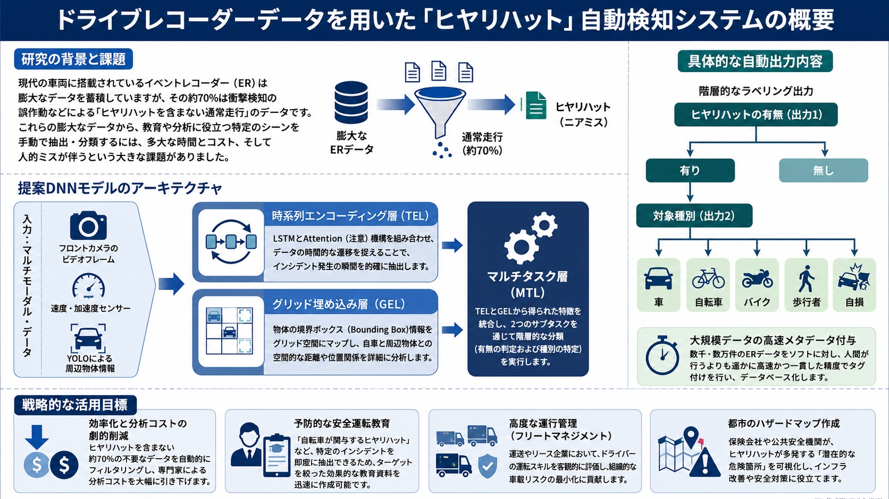
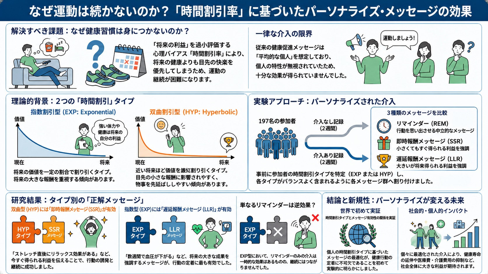

# 研究内容 / Research

## 研究室の目標 / Our Goal

リアルやWebにおける，観測可能な人の行動データをもとに，(1) 人文科学分野の知見を用いた人の**行動メカニズムの解明**，(2) 情報技術の道具を用いた人の**行動や意思決定のモデル化**，(3) 人の**行動を変容・支援**するための技術や方法論の構築，に取り組んでいます．「行動原理の解明（Science）→ 行動モデリング → 行動の変容・支援（Technology）」を一気通貫で扱うことが研究室の特徴です．

Based on observable human behavioral data collected on the Web and in the real world, we work on (1) **understanding behavioral mechanisms** using knowledge from the humanities, (2) **modeling human behavior and decision-making** with tools from information technology, and (3) building technologies and methodologies for **behavior change support**. A distinctive feature of our lab is that we cover the whole pipeline: "understanding behavioral principles (Science) → behavioral modeling → behavior change support (Technology)".

## 研究テーマ / Research Themes

1. [認知バイアスと行動経済学による行動分析 / Behavior analysis with cognitive biases and behavioral economics](#cognitive-bias)
2. [機械学習を用いたマルチモーダルデータ解析 / Multimodal data analysis with machine learning](#multimodal)
3. [個人適応型のNudge設計による行動変容支援 / Personalized nudge design for behavior change support](#nudge)

### 認知バイアスと行動経済学による行動分析 {#cognitive-bias}

**Behavior analysis with cognitive biases and behavioral economics**

私達はなぜ，数量限定の商品に惹かれたり，〆切間近まで仕事を先延ばしにしてしまうのでしょうか？その理由の1つは，私達が認知バイアスを持つためであると考えられています．認知バイアスとは，先入観や直感に頼って非合理的な意思決定をする心理傾向のことです．では，認知バイアスはどんな状況で発生しやすいのでしょうか？この研究では，人の「行動」や「状況」をデータとして収集し，データ分析と行動経済学の知見を組み合わせて，認知バイアスの発生傾向を定量的に明らかにすることを目指します．

Why are we drawn to limited-edition products, and why do we procrastinate until right before a deadline? One reason is that we have cognitive biases — psychological tendencies to make irrational decisions based on preconceptions and intuition. In this research, we collect data on people's behavior and situations, and combine data analysis with insights from behavioral economics to quantitatively reveal when and how cognitive biases occur.

!!! example "研究事例：プログラミングコンテストにおける損失回避傾向の分析 / Case study: Loss aversion in competitive programming contests"
    プログラミングコンテストサイトCodeforcesでは，コンテストの成績に応じてレートが変動し，レートに応じて「色（称号）」が与えられます．ユーザの参加履歴を分析すると，色境界を超えた直後に参加時間間隔が長くなる「損失回避的な行動」が確認されました．さらに，ユーザの過去の苦労（努力量）が損失回避傾向の強弱を説明できることを実証しました．これはプロスペクト理論（行動経済学の理論）の存在を実データで実証した研究であり，努力指標を用いたホワイトボックスな機械学習モデルが，LSTMなどのブラックボックスな手法よりも高い予測精度を達成することも示しています．（ICWSM2023 {==Outstanding User Modeling Paper==} 受賞研究）

    On Codeforces, a competitive programming platform, we found loss-averse behavior: participation intervals become longer right after users cross a rating "color" boundary, and the amount of past effort explains the strength of this loss aversion. This study empirically verified Prospect Theory with large-scale real-world data, and showed that a white-box machine learning model using effort features outperforms black-box methods such as LSTMs. (Awarded the {==Outstanding User Modeling Paper==} at ICWSM2023)

!!! example "研究事例：行動履歴からの現在バイアス推定 / Case study: Estimating present bias from behavior history"
    アンケートに頼らず，ウェアラブル端末などから得られる日々の行動履歴——心拍数などの連続データと，食事・睡眠・体重測定などのイベントデータ——から，Transformerベースのモデルで個人の現在バイアス（時間割引タイプ）を推定する手法を開発しました．257名の28日間の行動ログを用いた検証で，LSTMや標準的なTransformerを上回る推定精度を達成しています．（IEICE Transactions 2025 掲載研究）

    Instead of relying on questionnaires, we developed a Transformer-based model that estimates an individual's present bias (time-discounting type) from everyday behavior logs — continuous data such as heart rate and event data such as meals, sleep, and weight measurements. With 28-day behavior logs from 257 participants, the proposed method outperformed LSTMs and standard Transformers. (Published in IEICE Transactions, 2025)

    

    <small>図は論文の内容をもとにNotebookLMとChatGPTにより生成 The figure was generated with NotebookLM and ChatGPT based on the original paper.</small>

### 機械学習を用いたマルチモーダルデータ解析 {#multimodal}

**Multimodal data analysis with machine learning**

人の行動予測や理解は，多くの産業分野で重要な技術です．例えば，交通の分野では人流予測によって混雑の回避策を検討できます．人の行動はマルチモーダルデータとして蓄積されます．マルチモーダルデータとは，テキストや画像，センサなど複数のデータ形式が組み合わさったデータ集合のことです．この研究では，マルチモーダルデータに対して，機械学習を用いてそれぞれのデータを適切に処理し，データ間の相互作用を最大化することで，人の行動予測や理解を実現する基礎技術の開発を目指します．

Human behavior accumulates as multimodal data — collections of multiple data formats such as text, images, and sensor signals. In this research, we develop fundamental technologies that process each modality appropriately with machine learning and maximize the interaction between modalities to predict and understand human behavior.

!!! example "研究事例：時間的近接性を用いたセンサ・画像のクロスモーダル検索 / Case study: Cross-modal retrieval of sensor and image data with temporal closeness"
    心拍数やGPSなどのセンサデータと一人称視点画像を相互に検索できるようにする技術を開発しました．単なる時刻の近さだけでなく，時間帯や曜日といった「周期性」を統合した時間的近接性（Temporal Closeness）に基づいて学習サンプルを自動抽出し，各データを専用エンコーダで共有ベクトル空間に写して照合します．大規模ライフログデータセットLSC'24を用いた評価で，従来手法を有意に上回る検索精度（MRR）を達成しました．個人の行動理解やライフログ活用，ヘルスケア・行動分析などへの応用が期待されます．（MMM2025 掲載研究）

    We developed a technology that enables mutual retrieval between sensor data (e.g., heart rate and GPS) and first-person images. Training samples are automatically extracted based on temporal closeness, which integrates periodicity such as time of day and day of week, and each modality is projected into a shared vector space by dedicated encoders. On the large-scale lifelog dataset LSC'24, the proposed method significantly outperformed conventional approaches in retrieval accuracy (MRR). (Published at MMM2025)

    

    <small>図は論文の内容をもとにNotebookLMとChatGPTにより生成 The figure was generated with NotebookLM and ChatGPT based on the original paper.</small>

!!! example "研究事例：ドライブレコーダデータからのヒヤリハット自動検知 / Case study: Automatic near-miss detection from drive recorder data"
    車両のイベントレコーダに蓄積される映像・速度／加速度センサ・周辺物体情報のマルチモーダルデータから，ヒヤリハット（ニアミス）を自動検知するシステムを開発しました．LSTMとAttention機構による時系列エンコーディングと，物体の位置関係を捉えるグリッド埋め込みを組み合わせ，ヒヤリハットの有無とその対象（車・自転車・バイク・歩行者・自損）を階層的に分類します．大量データへの高速なメタデータ付与を実現し，安全運転教育や運行管理（フリートマネジメント），都市のハザードマップ作成などへの応用が期待されます．（IEICE Transactions 2022・PAKDD2020 掲載研究）

    We developed a system that automatically detects near-miss traffic incidents from multimodal event recorder data: video frames, speed/acceleration sensors, and surrounding-object information. Combining LSTM-and-attention time-series encoding with grid embeddings, the system hierarchically classifies whether a near-miss occurred and its target (car, bicycle, motorbike, pedestrian, or self). Applications include safe-driving education, fleet management, and urban hazard mapping. (Published in IEICE Transactions 2022 and at PAKDD2020)

    

    <small>図は論文の内容をもとにNotebookLMとChatGPTにより生成 The figure was generated with NotebookLM and ChatGPT based on the original paper.</small>

### 個人適応型のNudge設計による行動変容支援 {#nudge}

**Personalized nudge design for behavior change support**

人の不合理な行動は，どのような方法で良い方向に変えることができるでしょうか？方法の１つとして，Nudgeという介入策が知られています．Nudgeとは，認知バイアスを利用して人々の行動を無意識に導くための手法で，特定の選択をするようにさりげなく促すものです．現状，多くのNudgeは人々に対して一律の介入方針を提供します．この研究では，より効果的に人々の行動を変容するため，個人の認知バイアスの強弱を考慮したNudgeシステムを構築することを目指します．

How can we steer irrational human behavior in a better direction? Nudges leverage cognitive biases to gently guide people toward particular choices. Most existing nudges apply a uniform intervention policy to everyone; we build nudge systems that take into account the strength of each individual's cognitive biases to change behavior more effectively.

!!! example "研究事例：時間選好を考慮した健康行動促進メッセージング / Case study: Health-promoting messaging based on time preference"
    時間選好とは，人が目先の利益を高く見積り，将来の利益を低く見積もる性質のことです．実験参加者197名の時間選好の強さに合わせて，リマインド・即時報酬・遅延報酬メッセージを提示しわける4週間の実験を行いました．その結果，時間選好が強い人には「すぐ得られる小さな利益（即時報酬）」，弱い人には「将来得られる大きな利益（遅延報酬）」を伝えるメッセージが健康行動（ストレッチ）を効果的に誘発・持続させることを明らかにしました．（DICOMO2023 {==優秀論文賞==} 受賞研究）

    We conducted a four-week experiment with 197 participants in which reminder, immediate-reward, and delayed-reward messages were delivered according to each participant's time preference. Messages emphasizing "small immediate rewards" effectively induce and sustain healthy behavior for people with strong time preference, while "large future rewards" work better for people with weak time preference. (Awarded the {==Best Paper Award==} at DICOMO2023)

    

    <small>図は論文の内容をもとにNotebookLMとChatGPTにより生成 The figure was generated with NotebookLM and ChatGPT based on the original paper.</small>
