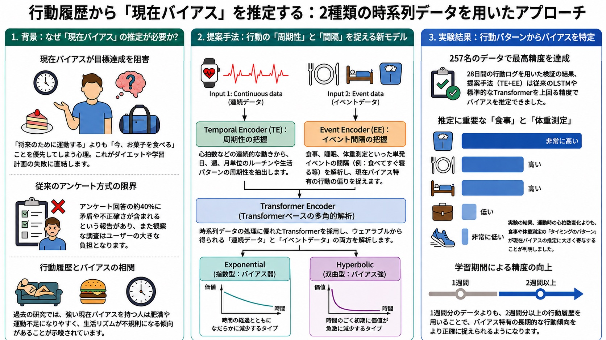
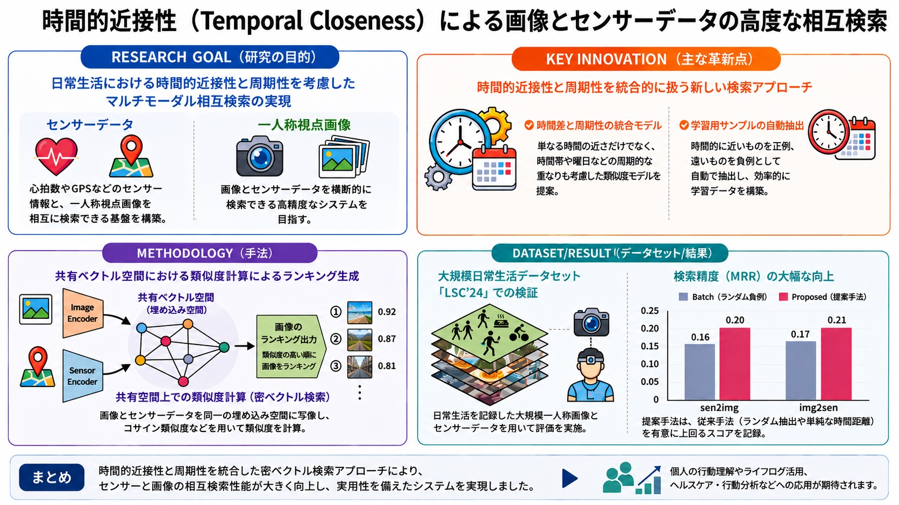
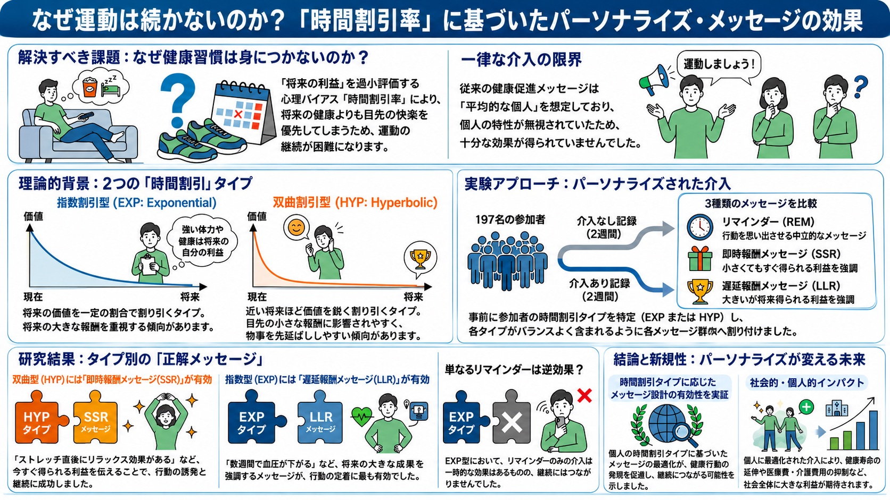

# 研究内容 / Research

## 研究室の目標 / Our Goal

Webや実世界で観測される人の行動・意思決定データをもとに，(1) 行動科学の知見を用いて，データに見られるパターンとその背景にあるメカニズムを検討すること，(2) 情報技術を用いて行動や意思決定をモデル化すること，(3) 本人や社会の目標に沿った意思決定・行動を支援する方法を設計・評価すること，に取り組んでいます．また，人の行動や意思決定を記録したマルチモーダルデータを対象とする情報検索技術も研究しています．

Using data on behavior and decision-making observed on the Web and in the real world, we study (1) patterns in behavior and their possible mechanisms through insights from behavioral science, (2) computational models of behavior and decision-making, and (3) the design and evaluation of methods that support choices and actions aligned with individual or societal goals. We also study information retrieval for multimodal data that records human behavior and decision-making.

## 研究における考え方 / Research Approach

人の行動を扱う研究では，データから観察される関連と因果関係を区別し，結果が成り立つ対象・条件・限界を明確にすることが重要です．また，行動データや介入を扱う際には，プライバシー，研究参加者の自律性，透明性，公平性への配慮が必要です．研究事例には，確認できる範囲で原著論文へのリンクを示します．

Research on human behavior should distinguish observed associations from causal relationships and make clear the populations, conditions, and limitations to which results apply. Research involving behavioral data or interventions also requires attention to privacy, participant autonomy, transparency, and fairness. Where available, the case studies below link to the original publications.

## 研究テーマ / Research Themes

1. [認知バイアスと行動経済学による行動分析 / Behavior analysis with cognitive biases and behavioral economics](#cognitive-bias)
2. [機械学習を用いたマルチモーダルデータ解析 / Multimodal data analysis with machine learning](#multimodal)
3. [個人適応型のNudge設計による行動支援 / Personalized nudge design for behavior support](#nudge)

### 認知バイアスと行動経済学による行動分析 {#cognitive-bias}

**Behavior analysis with cognitive biases and behavioral economics**

人の判断や選択には，状況に応じて体系的な傾向が表れることがあります．認知バイアスはそのような傾向を記述する概念であり，個々の判断を一律に「非合理」とみなすものではありません．この研究では，人の行動と状況をデータとして捉え，データ分析と行動経済学の知見を組み合わせて，どのような条件でどのような傾向が観察されるかを検討します．

Human judgment and choice can exhibit systematic patterns that depend on context. Cognitive bias describes such patterns; it does not mean that every individual decision should be treated as irrational. We combine behavioral data with insights from behavioral economics to examine which tendencies are observed under which conditions.

!!! example "研究事例：プログラミングコンテストにおける損失回避傾向の分析 / Case study: Loss aversion in competitive programming contests"
    プログラミングコンテストサイトCodeforcesの参加履歴を分析した研究では，ユーザがレートの「色（称号）」の境界を超えた後に，次の参加までの間隔が長くなる傾向が観察されました．また，過去の努力量とその傾向の関係を分析しました．この結果は損失回避の観点から解釈でき，報告された比較実験では，努力量を特徴として用いる解釈可能なモデルがLSTM等の比較手法を上回りました．結果の範囲は，分析したデータと評価設定に基づきます．（ICWSM2023 {==Outstanding User Modeling Paper==}）

    A study of Codeforces participation histories observed longer intervals before the next contest after users crossed a rating-color boundary. It also examined the relationship between past effort and this pattern. The findings are consistent with an interpretation based on loss aversion, and in the reported experiments an interpretable model using effort features outperformed comparison methods including LSTMs. The conclusions are limited to the analyzed data and evaluation setting. (ICWSM2023 Outstanding User Modeling Paper)

    [原著論文 / Source paper](https://doi.org/10.1609/icwsm.v17i1.22164){:target="_blank" rel="noopener"}

!!! example "研究事例：行動履歴からの現在バイアス推定 / Case study: Estimating present bias from behavior history"
    257名・28日間の行動ログを用いて，心拍数等の連続データと，食事・睡眠・体重測定等のイベントデータから，時間割引タイプを推定するTransformerベースの手法を検討しました．研究で用いた評価設定では，提案手法がLSTMおよび標準的なTransformerの比較手法を上回りました．（IEICE Transactions 2025）

    Using 28-day behavior logs from 257 participants, this study examined a Transformer-based method for estimating time-discounting types from continuous data such as heart rate and event data such as meals, sleep, and weight measurements. In the reported evaluation setting, the proposed method outperformed the LSTM and standard-Transformer baselines. (IEICE Transactions, 2025)

    [原著論文 / Source paper](https://doi.org/10.1587/transinf.2024EDP7248){:target="_blank" rel="noopener"}

<figure class="research-figure">
  <a href="../img/research_present_bias.jpg" target="_blank" rel="noopener" aria-label="行動履歴からの現在バイアス推定の概念図を高解像度で表示（新しいタブ）">
    <picture>
      <source type="image/webp" srcset="../img/research_present_bias-960.webp 960w, ../img/research_present_bias.webp 1672w" sizes="(max-width: 76rem) 100vw, 48rem">
      
    </picture>
  </a>
  <figcaption>論文内容をもとにNotebookLMとChatGPTで作成した概念図です（原著論文の図そのものではありません）．<a href="../img/research_present_bias.jpg" target="_blank" rel="noopener">高解像度で表示 / View full size</a> An AI-generated conceptual summary based on the paper, not an original figure from the publication.</figcaption>
</figure>

### 機械学習を用いたマルチモーダルデータ解析 {#multimodal}

**Multimodal data analysis with machine learning**

人の行動に関するデータは，テキスト，画像，位置情報，センサ信号等，複数の形式で記録されます．この研究では，各モダリティの特徴と相互の関係を機械学習で表現し，行動の分析や，異なるモダリティを横断する情報アクセスに利用する方法を検討します．

Data related to human behavior can be recorded as text, images, locations, sensor signals, and other modalities. We study machine-learning methods that represent the characteristics and relationships of these modalities for behavioral analysis and information access across data types.

!!! example "研究事例：時間的近接性を用いたセンサ・画像のクロスモーダル検索 / Case study: Cross-modal retrieval of sensor and image data with temporal closeness"
    心拍数やGPS等のセンサデータと一人称視点画像を相互に検索する手法を検討しました．時刻の近さに加えて，時間帯や曜日等の周期性を組み込んだTemporal Closenessにより学習サンプルを抽出し，各データを共有ベクトル空間へ写像します．LSC'24を用いた報告済みの評価では，提案手法が比較手法より高いMRRを示しました．（MMM2025）

    This study examined mutual retrieval between sensor data such as heart rate and GPS and first-person images. Temporal Closeness incorporates periodic patterns such as time of day and day of week when selecting training samples, and maps the modalities into a shared vector space. In the reported evaluation on LSC'24, the proposed method achieved higher MRR than the comparison methods. (MMM2025)

    [原著論文 / Source paper](https://doi.org/10.1007/978-981-96-2071-5_13){:target="_blank" rel="noopener"}

<figure class="research-figure">
  <a href="../img/research_crossmodal_retrieval.jpg" target="_blank" rel="noopener" aria-label="時間的近接性によるクロスモーダル検索の概念図を高解像度で表示（新しいタブ）">
    <picture>
      <source type="image/webp" srcset="../img/research_crossmodal_retrieval-960.webp 960w, ../img/research_crossmodal_retrieval.webp 1672w" sizes="(max-width: 76rem) 100vw, 48rem">
      
    </picture>
  </a>
  <figcaption>論文内容をもとにNotebookLMとChatGPTで作成した概念図です（原著論文の図そのものではありません）．<a href="../img/research_crossmodal_retrieval.jpg" target="_blank" rel="noopener">高解像度で表示 / View full size</a> An AI-generated conceptual summary based on the paper, not an original figure from the publication.</figcaption>
</figure>

!!! example "研究事例：ドライブレコーダデータからのヒヤリハット自動検知 / Case study: Automatic near-miss detection from drive recorder data"
    車両のイベントレコーダに記録された映像，速度・加速度センサ，周辺物体情報を用いて，ヒヤリハットの有無と対象を分類するモデルを構築・評価しました．LSTMとAttentionによる時系列表現と，物体の位置関係を表すグリッド埋め込みを組み合わせています．大量の記録から確認対象を絞り込む用途等が考えられますが，実運用には利用環境に応じた追加検証が必要です．（IEICE Transactions 2022・PAKDD2020）

    Using video, speed and acceleration signals, and surrounding-object information recorded by vehicle event recorders, these studies built and evaluated models that classify whether a near-miss occurred and identify its target. The models combine LSTM-and-attention time-series representations with grid embeddings of object positions. They may help narrow down records for review, although deployment would require further validation in the intended environment. (IEICE Transactions 2022; PAKDD2020)

    [IEICE Transactions 2022](https://doi.org/10.1587/transinf.2021EDP7017){:target="_blank" rel="noopener"} ／ [PAKDD2020](https://doi.org/10.1007/978-3-030-47436-2_54){:target="_blank" rel="noopener"}

<figure class="research-figure">
  <a href="../img/research_nearmiss_detection.jpg" target="_blank" rel="noopener" aria-label="ドライブレコーダデータによるヒヤリハット検知の概念図を高解像度で表示（新しいタブ）">
    <picture>
      <source type="image/webp" srcset="../img/research_nearmiss_detection-960.webp 960w, ../img/research_nearmiss_detection.webp 1672w" sizes="(max-width: 76rem) 100vw, 48rem">
      
    </picture>
  </a>
  <figcaption>論文内容をもとにNotebookLMとChatGPTで作成した概念図です（原著論文の図そのものではありません）．<a href="../img/research_nearmiss_detection.jpg" target="_blank" rel="noopener">高解像度で表示 / View full size</a> An AI-generated conceptual summary based on the papers, not an original figure from either publication.</figcaption>
</figure>

### 個人適応型のNudge設計による行動支援 {#nudge}

**Personalized nudge design for behavior support**

人の選択や行動は，情報の示し方や選択肢の構成から影響を受けることがあります．Nudgeは，選択の自由を残しながら，選択環境を通じて意思決定を後押しするアプローチです．何を望ましい結果とするか，またどのような効果が得られるかは対象や文脈によって異なります．そのため，介入の設計・評価では，個人の自律性，透明性，プライバシー，公平性を考慮する必要があります．この研究では，一律の介入だけでなく，個人差を考慮した支援方法を検討します．

Choices and actions can be influenced by how information and options are presented. Nudges shape the choice environment while preserving freedom of choice. What counts as a desirable outcome, and which effects can be expected, depends on the population and context. Their design and evaluation therefore require attention to autonomy, transparency, privacy, and fairness. We study support methods that consider individual differences rather than relying only on uniform interventions.

!!! example "研究事例：時間選好を考慮した健康行動促進メッセージング / Case study: Health-promoting messaging based on time preference"
    197名を対象に，時間選好の違いに応じて，リマインド，即時報酬，遅延報酬を強調するメッセージを提示する4週間の実験を行いました．報告された実験条件の範囲では，時間選好とメッセージの組み合わせによって，ストレッチの実施・継続への反応が異なることが示されました．この結果は，特定の参加者群・行動・期間における評価であり，他の状況への適用には追加検証が必要です．（DICOMO2023 {==優秀論文賞==}）

    A four-week experiment with 197 participants compared reminder, immediate-reward, and delayed-reward messages in relation to participants' time preferences. Under the reported experimental conditions, responses in starting and continuing stretching differed across combinations of time preference and message framing. The evaluation concerned a particular participant group, behavior, and duration; applying the findings elsewhere requires further validation. (DICOMO2023 Best Paper Award)

    [原著論文 / Source paper](https://ipsj.ixsq.nii.ac.jp/records/228100){:target="_blank" rel="noopener"}

<figure class="research-figure">
  <a href="../img/research_timepref_messaging.jpg" target="_blank" rel="noopener" aria-label="時間選好に応じた健康行動促進メッセージングの概念図を高解像度で表示（新しいタブ）">
    <picture>
      <source type="image/webp" srcset="../img/research_timepref_messaging-960.webp 960w, ../img/research_timepref_messaging.webp 1672w" sizes="(max-width: 76rem) 100vw, 48rem">
      
    </picture>
  </a>
  <figcaption>論文内容をもとにNotebookLMとChatGPTで作成した概念図です（原著論文の図そのものではありません）．<a href="../img/research_timepref_messaging.jpg" target="_blank" rel="noopener">高解像度で表示 / View full size</a> An AI-generated conceptual summary based on the paper, not an original figure from the publication.</figcaption>
</figure>
